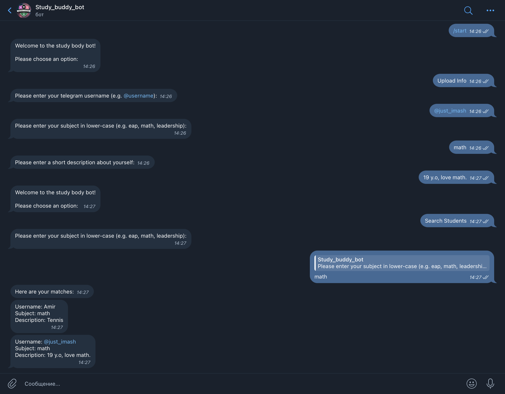

# Study Buddy Telegram Bot
## Project Description
This project aims to modernize and automate the traditional StudyBuddy Sessions by using the Telegram application, Python libraries for Telegram and database interactions. It introduces a chatbot (ID: @Study_buddy_nu_bot) that facilitates the process of finding study partners with shared interests. Within its first month, the project successfully helped 150 students connect with compatible study buddies.
## Features
The Telegram bot features two primary functions:
+ Profile Creation: Enables users to create a personalized profile containing details such as their name, preferred subjects for joint study, and additional relevant information.
+ Search and Filter: Allows users to search for study partners using filters based on the subject of study.

## Instalation
### Prerequisites
Before setting up the project, ensure you have the following installed:
+ Python 3.13.1+: [Download Python](https://www.python.org/downloads/)
+ pip (Python package manager): Comes with Python installation.
+ Git: [Download Git](https://git-scm.com)
+ Telegram Application: For interacting with the chatbot.
+ SQLite Studio: For managing and interacting with the database. [Download SQLite Studio](https://sqlitestudio.pl)

### Installation Steps
1) Clone the repository:
    ```bash
    git clone https://github.com/JustImash/Telegram-Study-Buddy-Bot
2) Navigate to the project directory:
   ```bash
   cd Telegram-Study-Buddy-Bot
3) Create a virtual environment:
    ```bash
    python3 -m venv venv
4) Activate the virtual environment:
   + On Windows:
        ```bash
        venv\Scripts\activate
   + On macOS/Linux:
        ```bash
        source venv/bin/activate
5) Install the telegram library:  
   ```bash
    pip install telegram
6) Start the application:
   ```bash
   python3 study_buddy_bot.py

## Usage
1) To initiate the bot, click the "Start" button or enter the following command in the chat: ```/start``` 
2) To create your profile, click the "Upload Info" button and follow these steps:
    + Provide your Telegram username (e.g., @username).
    + Specify the subject you want to study (e.g., EAP, Math, Leadership).
    + Add additional details and a description to your profile.
3) To find a Study Buddy, click the "Search Students" button and follow these steps:
    + Enter the subject you want to study.


## Screenshots

Telegram Chat:


## Contributing

Guidelines for contributing to the project:

1. Fork the repository.
2. Create a new branch:
   ```bash
   git checkout -b feature-name
3) Make your changes and commit them:
   ```bash
   git commit -m "Description of changes"
4) Push to your branch:
   ```bash 
   git push origin feature-name
5) Open a pull request.

## License

This project is licensed under the MIT License.

## Contacts
+ Imangali Zhapakov: Imanzhapaqov@gmail.com
+ Project Link: https://github.com/JustImash/Telegram-Study-Buddy-Bot
## Acknowledgments

Special thanks to all contributors and supporters of this project.